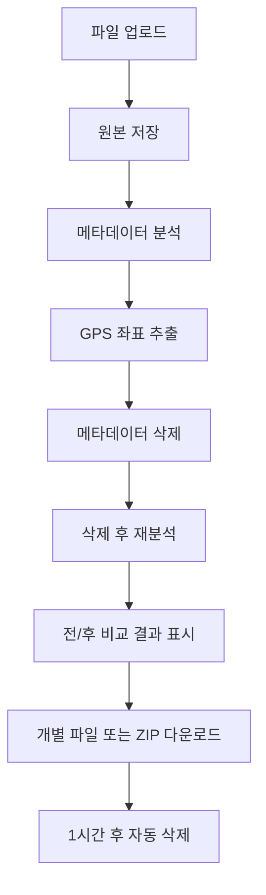

# 🧹 MetaWasher

> 사진과 동영상의 메타데이터를 안전하게 삭제하는 웹 애플리케이션


MetaWasher는 Python Flask 기반의 사진/동영상 **메타데이터 삭제** 웹 애플리케이션입니다.  
업로드한 원본 파일은 수정하지 않고, **메타데이터가 제거된 사본**을 생성하여 다운로드할 수 있습니다.

---

## ✨ 주요 기능

- **메타데이터 일괄 삭제** — GPS 위치, 촬영 기종, 작성자, 소프트웨어 등 민감 정보 제거
- **삭제 전/후 비교** — 삭제 전후의 민감 태그 목록을 시각적으로 비교
- **GPS 위치 표시** — 삭제 전 GPS 좌표를 Google Maps 지도에 표시 (API 키 설정 시)
- **다중 파일 처리** — 여러 파일을 한 번에 업로드하고 개별 또는 ZIP으로 다운로드
- **드래그 앤 드롭** — 파일을 드래그하여 간편하게 업로드
- **원본 보존** — 원본 파일은 수정하지 않고 정리된 사본만 생성
- **자동 정리** — 업로드/결과 파일은 1시간 후 서버에서 자동 삭제

---

## 🗑️ 삭제 대상

| 카테고리 | 세부 항목 |
|---|---|
| **위치 정보** | GPS 위도/경도/고도/위치 태그 |
| **기기 정보** | 촬영 기종, 제조사, 렌즈, 시리얼 번호 |
| **개인 정보** | 작성자, 소유자, 이메일, 전화번호 |
| **소프트웨어** | 편집 도구, 소프트웨어 이름 |
| **네트워크** | IP 주소, 호스트명 (XMP/IPTC 커스텀 태그) |
| **macOS 속성** | 확장 속성(xattr) 추가 정리 |

> ⚠️ **주의**  
> 이미지 픽셀에 직접 삽입된 위치 정보나 영상 화면/음성에 포함된 개인정보는 메타데이터가 아니므로 삭제되지 않습니다.  
> 완전한 비식별화가 필요하면 이미지 모자이크, 음성 제거, 프레임 편집 등의 추가 처리가 필요합니다.

---

## 🛠️ 기술 스택

- **백엔드**: Python 3.9+, Flask
- **메타데이터 처리**: [ExifTool](https://github.com/exiftool/exiftool) (기본 엔진)
- **동영상 보조 처리**: [FFmpeg](https://ffmpeg.org/) (ExifTool 실패 시 폴백)
- **프론트엔드**: Vanilla HTML/CSS/JavaScript
- **지도**: Google Maps JavaScript API (선택 사항)

---

## 📂 프로젝트 구조

```text
metadata-cleaner-web/
├── app.py                  # Flask 메인 애플리케이션 (라우팅, 업로드, 다운로드)
├── metadata_cleaner.py     # 메타데이터 분석/삭제 핵심 모듈
├── requirements.txt        # Python 의존성 패키지
├── .env                    # 환경 변수 (API 키 등, Git 미추적)
├── .gitignore              # Git 추적 제외 목록
├── templates/
│   └── index.html          # Jinja2 메인 페이지 템플릿
├── static/
│   ├── styles.css          # 메인 스타일시트
│   └── app.js              # 클라이언트 사이드 JavaScript
└── instance/
    └── jobs/               # 업로드/처리 파일 임시 저장 디렉토리
```

---

## 🚀 설치 및 실행

### 사전 요구 사항

- Python 3.9 이상
- [ExifTool](https://exiftool.org/) (필수)
- [FFmpeg](https://ffmpeg.org/) (선택 — 동영상 보조 처리)

---

### 1. 저장소 클론

```bash
git clone https://github.com/<your-username>/metadata-cleaner-web.git
cd metadata-cleaner-web
```

> `<your-username>` 부분을 실제 GitHub 사용자명 또는 저장소 주소로 교체하세요.

---

### 2. 가상 환경 설정 및 의존성 설치

#### macOS / Linux

```bash
python3 -m venv .venv
source .venv/bin/activate
pip install -r requirements.txt
```

#### Windows

```bash
python -m venv .venv
.venv\Scripts\activate
pip install -r requirements.txt
```

---

### 3. 외부 도구 설치

#### macOS (Homebrew)

```bash
brew install exiftool ffmpeg
```

#### Ubuntu / Debian

```bash
sudo apt install libimage-exiftool-perl ffmpeg
```

#### Windows

1. [ExifTool 공식 사이트](https://exiftool.org/)에서 다운로드
2. [FFmpeg 공식 사이트](https://ffmpeg.org/download.html)에서 다운로드
3. 각각 시스템 `PATH`에 추가

설치 후 아래 명령어로 정상 설치 여부를 확인할 수 있습니다.

```bash
exiftool -ver
ffmpeg -version
```

---

### 4. 실행

#### macOS / Linux

```bash
source .venv/bin/activate
python app.py
```

#### Windows

```bash
.venv\Scripts\activate
python app.py
```

브라우저에서 아래 주소로 접속합니다.

```text
http://127.0.0.1:5000
```

---

## 🗺️ Google Maps 위치 표시 (선택 사항)

GPS 좌표가 포함된 파일을 업로드하면 삭제 전 촬영 위치를 결과 화면에 표시합니다.  
Google Maps API 키를 설정하면 지도 마커와 주소 역지오코딩이 활성화됩니다.

### 설정 방법

프로젝트 루트에 `.env` 파일을 생성하고 다음 내용을 추가합니다.

```bash
GOOGLE_MAPS_API_KEY=발급받은_API_키
```

또는 환경 변수로 직접 설정합니다.

#### macOS / Linux

```bash
export GOOGLE_MAPS_API_KEY="발급받은_API_키"
python app.py
```

#### Windows PowerShell

```powershell
$env:GOOGLE_MAPS_API_KEY="발급받은_API_키"
python app.py
```

#### Windows CMD

```cmd
set GOOGLE_MAPS_API_KEY=발급받은_API_키
python app.py
```

> **참고**  
> [Google Cloud Console](https://console.cloud.google.com/)에서 아래 API를 활성화해야 합니다.
>
> - Maps JavaScript API
> - Geocoding API
>
> API 키가 없으면 지도 대신 좌표와 Google Maps 링크만 표시됩니다.

---

## ⚙️ 처리 흐름



1. Flask가 업로드된 파일을 `instance/jobs/<job-id>/uploads`에 저장합니다.
2. ExifTool로 삭제 전 메타데이터를 JSON으로 읽습니다.
3. GPS 좌표가 있으면 결과 화면에 지도 표시용 위치 데이터를 전달합니다.
4. 원본을 복사한 뒤 `exiftool -overwrite_original -all=`로 사본의 메타데이터를 삭제합니다.
5. 동영상에서 ExifTool 처리가 실패하면 FFmpeg `-map_metadata -1 -c copy`로 보조 처리합니다.
6. 삭제 후 다시 메타데이터를 읽고 민감 태그 잔존 여부를 화면에 표시합니다.
7. 개별 파일 또는 ZIP으로 다운로드할 수 있습니다.

---

## 🧪 사용 방법

1. 웹 페이지에 접속합니다.
2. 사진을 드래그 앤 드롭하거나 파일 선택 버튼으로 업로드합니다.
3. 업로드된 파일의 메타데이터가 자동으로 분석됩니다.
4. 삭제 전 민감 정보와 GPS 위치 정보를 확인합니다.
5. 메타데이터가 제거된 사본을 다운로드합니다.
6. 여러 파일은 개별 다운로드 또는 ZIP 다운로드할 수 있습니다.

---

## 🧯 문제 해결

### `exiftool: command not found` 오류가 발생하는 경우

ExifTool이 설치되어 있지 않거나 시스템 `PATH`에 등록되어 있지 않습니다.

```bash
exiftool -ver
```

명령어가 인식되지 않으면 ExifTool을 설치하고 터미널을 다시 실행하세요.

---

### 동영상 메타데이터가 일부 남는 경우

ExifTool로 처리되지 않는 컨테이너 메타데이터는 FFmpeg 폴백으로 제거를 시도합니다.  
FFmpeg이 설치되어 있지 않으면 설치 후 다시 실행하세요.

```bash
ffmpeg -version
```

---

### Google Maps 지도가 표시되지 않는 경우

다음 항목을 확인하세요.

- `.env` 파일에 `GOOGLE_MAPS_API_KEY`가 올바르게 설정되어 있는지
- Google Cloud Console에서 **Maps JavaScript API**와 **Geocoding API**가 활성화되어 있는지
- API 키에 결제 계정 또는 사용 제한 설정이 올바르게 적용되어 있는지

API 키가 없으면 지도 대신 좌표와 Google Maps 링크만 표시됩니다.

---

### 업로드한 파일이 서버에 계속 남아 있나요?

업로드된 원본 파일과 처리 결과 파일은 `instance/jobs/` 아래에 임시 저장되며,  
보안을 위해 **1시간 후 자동으로 삭제**됩니다.

---

## 🔗 오픈소스 기반

이 프로젝트는 다음 오픈소스 도구를 활용합니다.

- [ExifTool](https://github.com/exiftool/exiftool) — 이미지/동영상 메타데이터 읽기 및 삭제 엔진
- [ExifCleaner](https://github.com/szTheory/exifcleaner) — ExifTool 기반 일괄 메타데이터 삭제 UX 참고
- [FFmpeg](https://ffmpeg.org/) — 동영상 컨테이너 메타데이터 보조 제거

---

## 📄 라이선스

이 프로젝트는 MIT 라이선스에 따라 배포됩니다.  
자세한 내용은 [LICENSE](LICENSE) 파일을 참조하세요.
